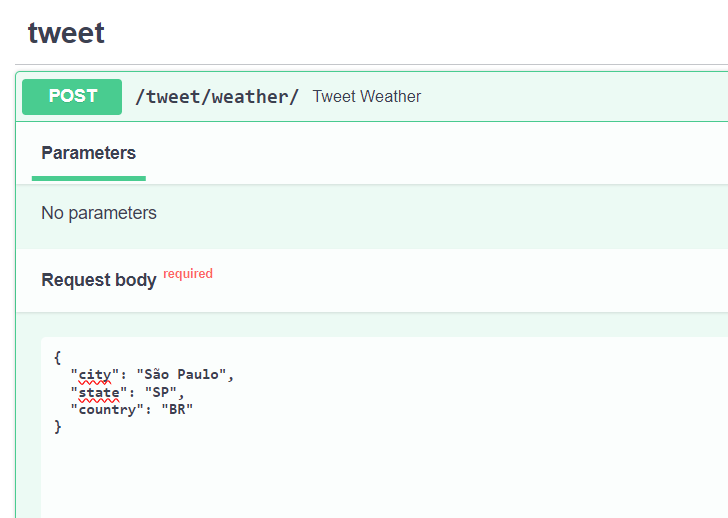
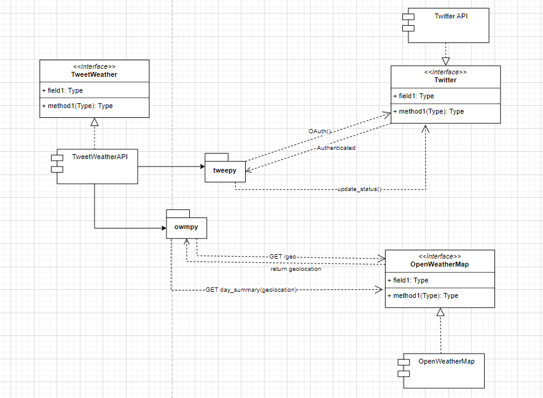

# tweet-weather

API service that tweets the weather of a location in the day of the requisition and the next 5 days

Before launch the API, make sure to create and set this environment variables:

From OpenWeatherAPI:
```
OPEN_WEATHER_MAP_API_KEY
```

From Twitter Dev Account where the weather tweet should be posted:
```
TWITTER_CONSUMER_KEY
TWITTER_CONSUMER_SECRET
TWITTER_ACCESS_TOKEN
TWITTER_ACCESS_TOKEN_SECRET
TWITTER_BEARER_TOKEN
```

To use the service call the endpoint in the image below specifying the city, state and country of the location:


The architecture of the solution:
